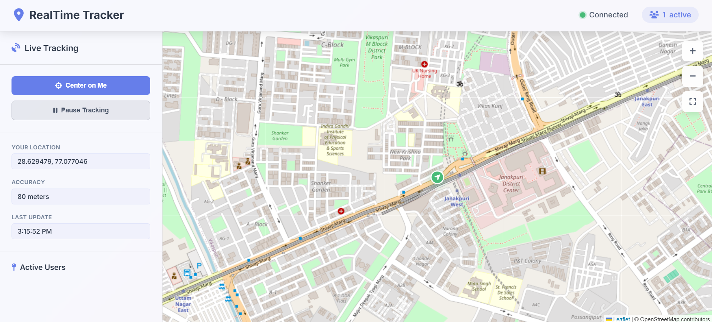

# Real-Time Tracking System

<p align="center">
  
</p>

A real-time location tracking web application that allows multiple users to share and view each other's live locations on an interactive map.

## Features

- **Real-time Location Sharing**: Users can share their current location with others in real-time
- **Interactive Map**: Built with Leaflet.js for smooth map interactions
- **Live User Tracking**: See all connected users on the map with custom markers
- **Responsive Design**: Modern UI that works on desktop and mobile devices
- **Connection Status**: Real-time connection status indicator
- **User Controls**: Pause/resume tracking, center on user, zoom controls
- **Smooth Animations**: Animated marker movements and UI transitions

## Tech Stack

- **Backend**: Node.js, Express.js, Socket.IO
- **Frontend**: HTML5, CSS3, JavaScript (ES6+)
- **Map**: Leaflet.js with OpenStreetMap tiles
- **Real-time Communication**: Socket.IO
- **Styling**: Custom CSS with modern design
- **Icons**: Font Awesome

## Installation

1. **Clone the repository**
   ```bash
   git clone https://github.com/sudhansu-24/realtime-tracking-system.git
   cd realtime-tracking-system
   ```

2. **Install dependencies**
   ```bash
   npm install
   ```

3. **Start the server**
   ```bash
   npm start
   # or
   node app.js
   ```

4. **Open in browser**
   Navigate to `http://localhost:3000`

## Usage

1. **Allow Location Access**: When prompted, allow the browser to access your location
2. **Share Your Location**: Your location will automatically be shared with other users
3. **View Other Users**: See other connected users on the map with different colored markers
4. **Controls**:
   - **Center on Me**: Centers the map on your current location
   - **Pause/Resume Tracking**: Toggle location sharing on/off
   - **Zoom Controls**: Zoom in/out on the map
   - **Fullscreen**: Toggle fullscreen mode

## Deployment

### Render (Recommended)

1. **Sign up** at [Render.com](https://render.com)
2. **Create a new Web Service**
3. **Connect your GitHub repository**
4. **Configure the service**:
   - **Build Command**: `npm install`
   - **Start Command**: `npm start`
5. **Deploy** and get your public URL

### Other Platforms

This app can be deployed on any platform that supports Node.js:
- **Railway**: Easy deployment with GitHub integration
- **Heroku**: Traditional Node.js hosting
- **Vercel**: Good for static sites (limited for Socket.IO)
- **DigitalOcean**: Full control over server

## Project Structure

```
realtime-tracking-system/
├── app.js                 # Main server file
├── package.json           # Dependencies and scripts
├── views/
│   └── index.ejs         # Main HTML template
├── public/
│   ├── css/
│   │   └── style.css     # Main stylesheet
│   └── js/
│       └── script.js     # Client-side JavaScript
└── README.md             # This file
```

## API Endpoints

- `GET /` - Serves the main application page
- `WebSocket /socket.io/` - Real-time communication for location updates

## Socket.IO Events

- `send-location` - Client sends location data to server
- `receive-location` - Server broadcasts location to all clients
- `user-disconnected` - Server notifies when a user disconnects

## Browser Compatibility

- Chrome/Chromium (recommended)
- Firefox
- Safari
- Edge

**Note**: HTTPS is required for geolocation on most browsers in production.

## Contributing

1. Fork the repository
2. Create a feature branch (`git checkout -b feature/amazing-feature`)
3. Commit your changes (`git commit -m 'Add amazing feature'`)
4. Push to the branch (`git push origin feature/amazing-feature`)
5. Open a Pull Request

## License

This project is licensed under the ISC License.

## Support

For support, please open an issue on GitHub or contact the maintainer.

---

**Built with ❤️ using Node.js, Express, Socket.IO, and Leaflet** 